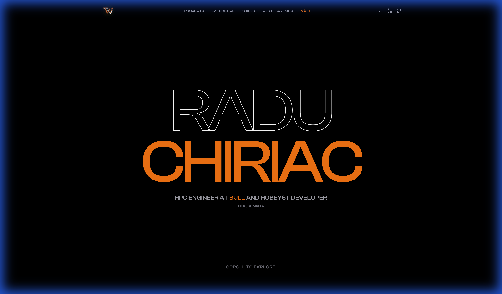

# The-Whiz.dev | Cyberpunk Portfolio



This is the source code for my personal portfolio website, [the-whiz.dev](https://the-whiz.dev).
Designed with a **Cyberpunk / Neon Aesthetic**, featuring glitch effects, terminal-inspired stats, and a high-performance modern stack.

## ✨ Features

-   **Cyberpunk Design**: Neon Cyan & Pink color palette with glassmorphism and glow effects.
-   **Interactive UI**: Smooth animations powered by Framer Motion.
-   **Glitch Typography**: Custom `GlitchText` components for a retro-futuristic feel.
-   **Responsive Layout**: Fully optimized for Desktop, Tablet, and Mobile.
-   **Performance First**: Engineered with Vite and React for lightning-fast loads.

## 🛠️ Tech Stack

-   **Framework**: React 19 (Vite)
-   **Language**: TypeScript
-   **Styling**: Tailwind CSS v4
-   **Animations**: Motion (Framer Motion)
-   **Icons**: Lucide React
-   **Package Manager**: Bun

## 🚀 Getting Started

To run this project locally:

### Prerequisites

-   **Bun**: Latest version (Required)

### Installation

1.  **Clone the repository**:
    ```bash
    git clone https://github.com/the-whiz84/the-whiz.dev.git
    cd the-whiz.dev
    ```

2.  **Install dependencies**:
    ```bash
    bun install
    ```

3.  **Run the development server**:
    ```bash
    bun run dev
    ```

4.  **Open the browser**:
    Navigate to `http://localhost:5173` to verify "ROOT ACCESS GRANTED".

## 📦 Deployment

Optimized for deployment on [Vercel](https://vercel.com).
Push to main/master branch to trigger automatic builds.

## 📄 License

This project is licensed under the MIT License - see the [LICENSE](LICENSE) file for details.

---

Built with ❤️ and ☕ by [Radu Chiriac](https://the-whiz.dev) // **ENGINEERED FOR PERFORMANCE**
