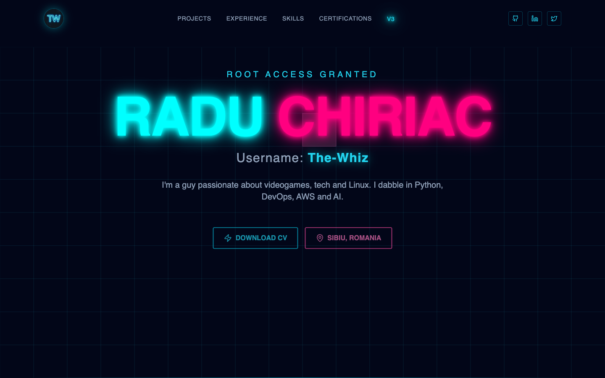

# The-Whiz.dev | Cyberpunk Portfolio



This is the source code for my personal portfolio website, [the-whiz.dev](https://the-whiz.dev).
Designed with a **Cyberpunk / Neon Aesthetic**, featuring glitch effects and a high-performance modern stack.

## ✨ Features

-   **Cyberpunk Design**: Neon Cyan & Pink color palette with glassmorphism and glow effects.
-   **Interactive UI**: Smooth animations powered by Framer Motion, featuring mouse-tracking neon spotlight effects on cards and in the hero grid.
-   **Hero-Scoped Cyber Grid**: A lightweight interactive SVG grid appears only in the hero section, keeping the rest of the site clean and fast.
-   **Readable CTA Zone**: Grid activation is disabled over hero CTAs so action buttons remain visually clear.
-   **Glitch Typography**: Custom `GlitchText` components for a retro-futuristic feel.
-   **Live System Stats**: Hero section displays real-time GitHub public repo count (fetched from the GitHub API) and developer uptime since first commit — styled as a terminal widget.
-   **Neon Section Dividers**: Animated cyan breathing dividers separate each page section.
-   **Mobile Card Interactions**: Scroll-triggered `IntersectionObserver` activates card hover effects on touch devices, replacing the unavailable hover state.
-   **Responsive Layout**: Fully optimized for Desktop, Tablet, and Mobile.
-   **Performance First**: Engineered with Vite, React, and deeply optimized WebP assets for lightning-fast loads.
-   **Vercel Speed Insights**: Integrated real-user performance monitoring via `@vercel/speed-insights`.

## 🛠️ Tech Stack

-   **Framework**: React 19 (Vite)
-   **Language**: TypeScript
-   **Styling**: Tailwind CSS v4
-   **Animations**: Motion (Framer Motion)
-   **Icons**: Lucide React
-   **Package Manager**: Bun
-   **Deployment**: Vercel (with Speed Insights)

## 🚀 Getting Started

To run this project locally:

### Prerequisites

-   **Bun**: Latest version (Required)

### Installation

1.  **Clone the repository**:
    ```bash
    git clone https://github.com/the-whiz84/the-whiz.dev.git
    cd the-whiz.dev
    ```

2.  **Install dependencies**:
    ```bash
    bun install
    ```

3.  **Run the development server**:
    ```bash
    bun run dev
    ```

4.  **Open the browser**:
    Navigate to `http://localhost:5173` to verify "ROOT ACCESS GRANTED".

## 📦 Deployment

Optimized for deployment on [Vercel](https://vercel.com).
Push to main/master branch to trigger automatic builds.

## 📄 License

This project is licensed under the MIT License - see the [LICENSE](LICENSE) file for details.

---

Built with ❤️ and ☕ by [Radu Chiriac](https://the-whiz.dev)
